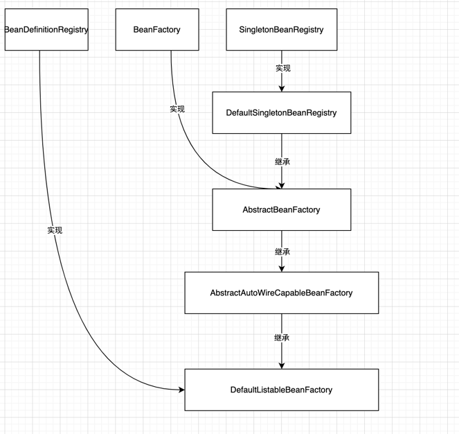

# 第二篇 初窥门径
- - -
首先重写了BeanFactory、BeanDefinition

让我来解释一下为什么需要重写，从BeanDefinition开始由原来的Object换成了Class，这样做的原因是，对于new对象这一步其实应该通过反射或者代理去创建的，而不是存放一个实例

而BeanFactory存粹是觉得，这样一个庞大的框架，我们应该尽可能的去拆分，一开始放在BeanFactory可能想的有些单纯，因此将BeanFactory设计成为顶级接口

- - -
新增接口 SingletonBeanRegistry，用来获取单例接口

新增接口 BeanDefinitionRegistry,用来注册BeanDefinition

新增类 DefaultSingletonBeanRegistry，实现SingletonBeanRegistry，表示单例Bean的默认实现类。里面提供了单例对象池，允许获取和添加新的单例bean

新增抽象类 AbstractAutowireCapableBeanFactory，继承于DefaultSingletonBeanRegistry。提供了创建bean的方式，通过newInstance()进行对象的创建,并添加进入单例bean容器

新增类 DefaultListableBeanFactory 继承AbstractAutowireCapableBeanFactory 实现BeanDefinitionRegistry，表示该类允许创建、获取、注册Bean容器。它同样有一个BeanDefinitionMap池

