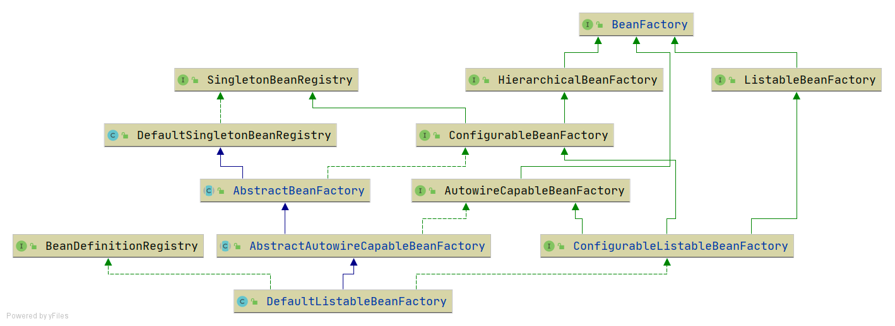

# 第五篇 XML解析
在上一篇中完成了对类的属性填充，这一篇则是通过xml配置的方式，去进行类型填充以及bean注入。

想要进行xml解析，首先需要完成资源的加载，资源的加载有很多种类型，比如网络资源，本地资源。因此需要一个接口，统一标准

新增 Resource 接口 资源加载类的接口类，定义方法 getInputStream()
+ FileSystemResource 通过文件路径进行资源加载
+ UrlResource 通过网络url进行资源加载
+ ClassPathResource classpath下资源的实现类

ResourceLoader接口则是资源查找定位策略的抽象，DefaultResourceLoader是它的默认实现

现在资源加载器已经有了，就可以在xml配置文件中定义bean的信息，资源加载器加载xml资源，解析出bean的信息，然后注册到bean容器中

BeanDefinitionReader是读取Bean定义信息的抽象接口，XmlBeanDefinitionReader是它的实现类，用于进行xml解析。
BeanDefinitionReader需要有获取资源的能力，并且获取bean信息以后能够进行BeanDefinition注册

在此基础上 新增AbstractBeanDefinitionReader 是对BeanDefinitionReader的一个抽象类，增加
BeanDefinitionRegistry 和ResourceLoader 两个属性。所有具体实现应该实现这个抽象类，以此达到拥有注册和资源管理的能力

由于从XML文件中读取还没有定义属性类型，所以目前属性只支持String和引用其他Bean，后面会增加类型转换器，实现类型定义。
