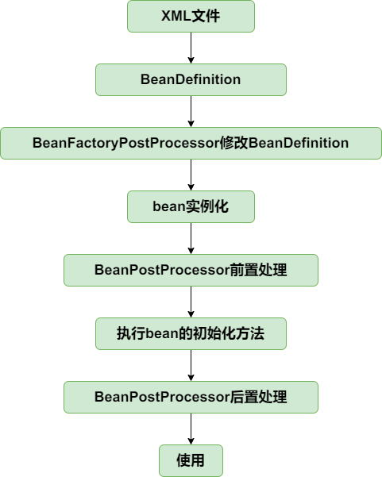

# 第六篇 崭露头角，实现应用上下文，扩展机制
扩展机制BeanFactoryPostProcessor和BeanPostProcessor，这两个是Spring非常重要的两个接口。

BeanFactoryPostProcessor允许在Bean实例化之前修改Bean的定义信息也就是BeanDefinition

BeanPostProcessor也是spring提供的容器扩展机制，不同于BeanFactoryPostProcessor的是，BeanPostProcessor在bean实例化后修改bean或替换bean

到此为止，从bean的角度出发，整个生命周期演进成为如下

应用上下文ApplicationContext
它是比BeanFactory功能更为强大的IOC容器，ApplicationContext除了拥有BeanFactory的功能以外，
还支持特殊bean的加载以及资源加载。他是面向于用户的。流程的核心加载都写在了AbstractApplicationContext的#refresh方法中
